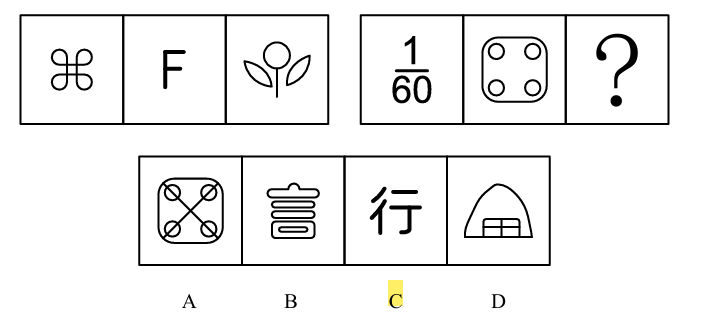

# 错题 10：图形推理-数量类-笔画数

**来源**：决战行测5000题（上册）- 数量规律-笔画数 - 夯实基础第6题

点击查看答案

<b>你的答案</b>：— 
<b>正确答案</b>：C  
<b>详细解答</b>： 第一组图中，第一幅图为圆相切的变形图，第二、三幅图出现端点，考虑笔画数。第一组图形的笔画数依次为1、2、3，第二组图形的笔画数依次为4、5、？，故问号处应为笔画数为6的图形，只有C项符合。  
<b>错误原因</b>：受常识影响，"F"的笔画数错，误认为有三笔，导致未发现笔画规律

