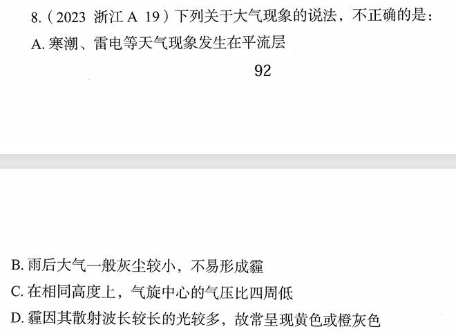

# 错题 100：地理-大气现象与大气层结构

**来源**：2023年浙江A卷第19题

点击查看答案

<b>你的答案</b>：C 
<b>正确答案</b>：A  
<b>详细解答</b>： A项错误:**对流层**最主要的特征是存在着强烈的空气对流运动现象，风、雨、雪、雷电和寒潮等天气现象都发生在这里。**平流层**是地球大气层中上热下冷的一层，大气不对流，以平流运动为主，目前大型客机大多飞行于此层。因此，寒潮、雷电等天气现象发生在**对流层**而非平流层，A项说法错误。  B项正确:霾，也称灰霾(烟霞)，是指原因不明的因大量烟、尘等微粒悬浮而形成的浑浊现象。其形成有三方面因素:一是水平方向静风现象增多;二是垂直方向出现逆温现象;三是悬浮颗粒物增加。雨后大气灰尘较小，悬浮颗粒物较少，因此不容易形成霾。  C项正确:气旋是指北(南)半球，大气中水平气流逆(顺)时针旋转的大型涡旋。在相同高度上，气旋中心的气压比四周低，又称低压。  D项正确:霾的核心物质是空气中悬浮的灰尘颗粒，气象学上称为气溶胶颗粒。由于灰尘、硫酸、硝酸等粒子组成的霾，其散射波长较长的光比较多，因而霾看起来呈黄色或橙灰色。  本题为选非题，故正确答案为A。  
<b>错误原因</b>：不熟悉平流层对流层等知识

