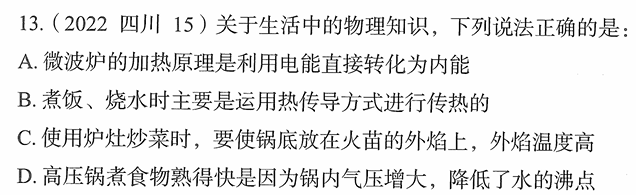

# 错题 101：物理-生活中的热学知识

**来源**：2022年四川第15题

点击查看答案

<b>你的答案</b>：B 
<b>正确答案</b>：C  
<b>详细解答</b>： A项错误:微波炉的加热原理是利用微波使食物中的水分子高速振动，分子间相互摩擦产生热量，从而使食物加热。这是**电能→微波能→内能**的转化过程，而非电能直接转化为内能。  B项错误:热传导是介质内无宏观运动时的传热现象，其在固体、液体和气体中均可发生，但严格而言，只有在固体中才是纯粹的热传导。而在流体中即使处于静止状态，也会由于温度梯度所造成的密度差而产生**自然对流**，因此，在流体中热对流与热传导同时发生。故烧水、煮饭主要运用的是**热传导和热对流**两种方式进行传热，而非仅仅是热传导。  C项正确:火焰分为三层:**焰心**（温度最低）、**内焰**（中等温度）、**外焰**（温度最高）。外焰与空气接触充分，燃烧最完全，温度最高。因此，使用炉灶炒菜时，要使锅底放在火苗的外焰上，这样加热效率最高。  D项错误:高压锅煮食物熟得快是因为锅内气压增大，**提高了水的沸点**（而非降低），使水在更高的温度下沸腾，从而加快了食物的烹饪速度。气压与沸点的关系是:气压越大，沸点越高;气压越小，沸点越低。  
<b>错误原因</b>：不熟悉热对流的概念

