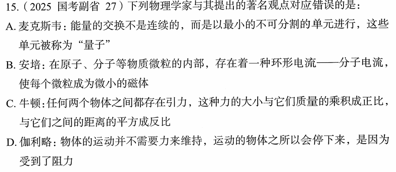

# 错题 102：物理-物理学家与其著名观点对应

**来源**：2025年国考副省第27题

点击查看答案

<b>你的答案</b>：B 
<b>正确答案</b>：A  
<b>详细解答</b>： A项错误:**量子**是现代物理学中的一个重要概念。一个物理量如果存在最小的不可分割的基本单位，则这个物理量是量子化的，这个最小单位称为量子。该概念最早是由德国物理学家**马克斯·普朗克**在1900年提出的。他假设黑体辐射中的辐射能量是不连续的，只能取能量基本单位的整数倍，从而很好地解释了黑体辐射的实验现象。**麦克斯韦**的主要贡献包括预言了**电磁波**的存在，建立了**麦克斯韦方程组**等，而非提出量子概念。因此A项对应错误。  B项正确:**安培**提出了**分子电流假说**，认为在原子、分子等物质微粒的内部，存在着一种环形电流——分子电流，使每个微粒成为微小的磁体，两个磁极分别在环形电流的两侧。这一假说成功解释了磁现象的电本质。  C项正确:**牛顿**提出了**万有引力定律**：任何两个物体之间都存在引力，这种力的大小与它们质量的乘积成正比，与它们之间的距离的平方成反比。公式为：F = G(m₁m₂)/r²，其中G为万有引力常量。  D项正确:**伽利略**通过理想实验提出了**惯性定律**的思想：物体的运动并不需要力来维持，运动的物体之所以会停下来，是因为受到了阻力。这一思想后来被牛顿总结为牛顿第一定律（惯性定律）。  本题为选非题，故正确答案为A。  
<b>错误原因</b>：不熟悉电磁波相关人物

