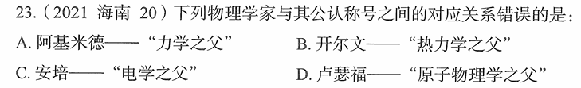

# 错题 103：物理-物理学家称号对应

**来源**：2021年海南第23题

点击查看答案

<b>你的答案</b>：A 
<b>正确答案</b>：C  
<b>详细解答</b>： A项正确:**阿基米德**被公认为"**力学之父**"。他是古希腊伟大的数学家、物理学家，发现了杠杆原理和浮力定律（阿基米德原理），在力学领域做出了开创性贡献。  B项正确:**开尔文**（威廉·汤姆森）被称为"**热力学之父**"。他在热力学领域做出了重要贡献，提出了绝对温标（开尔文温标），并表述了热力学第二定律的开尔文表述。  C项错误:**安培**的主要贡献在电磁学领域，提出了分子电流假说，发现了安培定律，电流单位"安培"以他命名。但"**电学之父**"的称号通常授予**法拉第**，法拉第发现了电磁感应现象，提出了电场和磁场的概念，为电学理论奠定了基础。因此，"安培——'电学之父'"的对应关系错误。  D项正确:**卢瑟福**被称为"**原子物理学之父**"或"原子核物理学之父"。他提出了原子的核式结构模型，发现了质子，开创了原子核物理学。  本题为选非题，故正确答案为C。  
<b>错误原因</b>：误以为力学之父是牛顿

