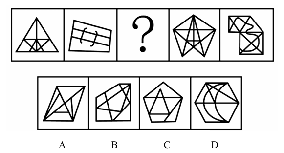

# 错题 11：图形推理-数量类-点与线（框内交点数=外框边数）

**来源**：决战行测5000题（上册）- 数量规律-点 - 夯实基础第7题

点击查看答案

<b>你的答案</b>：A 
<b>正确答案</b>：B  
<b>详细解答</b>： 观察发现，题干图形线条交叉明显且每幅图形明显分内外，考虑数图形内部交点。题干图形框内交点数依次为3、4、？、6、7，故问号处图形框内交点数应为5，排除C项。继续观察发现，题干每幅图形均有多边形外框，可以考虑外框边的数量。题干图形外框边的数量依次为3、4、？、6、7，即每幅图形外框边的数量等于框内交点的数量，只有B项符合。  
<b>错误原因</b>：没有将点和线的数量符合起来考虑

