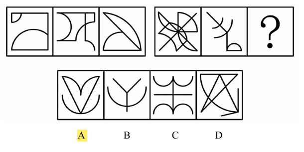

# 错题 12：图形推理-数量类-直线与曲线运算

**来源**：决战行测5000题（上册）- 数量规律-线 - 夯实基础第8题

点击查看答案

<b>你的答案</b>：— 
<b>正确答案</b>：A  
<b>详细解答</b>： 观察发现，题干每幅图均出现圆弧，且圆弧数量较多，考虑数曲线。第一组图形的曲线数依次为2、3、2，第二组图形的曲线数依次为5、3、？，无明显规律。继续观察发现，题干每幅图均出现直线，且直线数量较多，考虑数直线。第一组图形的直线数依次为4、4、2，第二组图形的直线数依次为6、3、？。第一组每幅图中直线数减去曲线数，差值依次为2、1、0，第二组每幅图中直线数减去曲线数，差值依次为1、0、？，因此问号处需要选择一个直线数减去曲线数所得差值为–1的图形，只有A项符合。  
<b>错误原因</b>：未发现直线、曲线的运算规律

