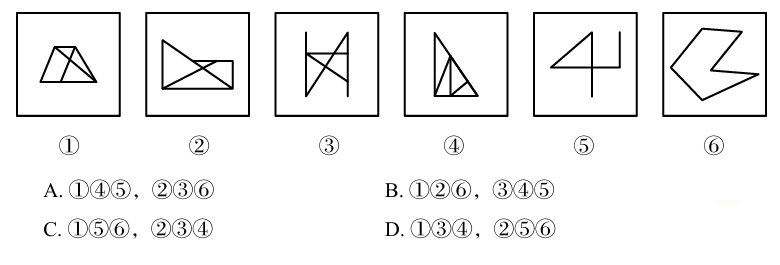

# 错题 13：图形推理-样式类-平行线（分组分类）

**来源**：决战行测5000题（上册）- 样式规律-平行线 - 高难进阶第1题

点击查看答案

<b>你的答案</b>：— 
<b>正确答案</b>：B  
<b>详细解答</b>： 本题为分组分类题目。元素组成不同，且无明显属性规律，考虑数量规律。观察发现，题干每幅图形均存在同一方向上成对出现的线条，考虑平行线。如下图所示，图①②⑥中均含有两组平行线，图③④⑤中均含有一组平行线，即图①②⑥为一组，图③④⑤为一组。  
<b>错误原因</b>：没发现图⑥中也有平行线，排除了平行相关可能性

