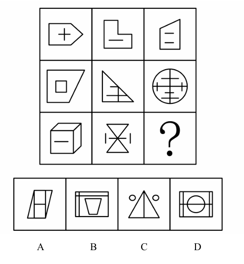

# 错题 14：图形推理-数量类-横竖线运算

**来源**：决战行测5000题（上册）- 数量规律-线 - 夯实基础第9题

点击查看答案

<b>你的答案</b>：— 
<b>正确答案</b>：A  
<b>详细解答</b>： 观察发现，题干图形出现较多单一横线和单一竖线，考虑分开数横竖线。九宫格优先看横行，三行图形的横线数依次为3、4、3，4、3、4，4、3、？；三行图形的竖线数依次为2、3、2，3、2、3，3、2、？。分开看一种线数量无规律，考虑二者做运算。题干已知每幅图形均满足：横线数－竖线数＝1，故问号处图形也应满足此规律，只有A项符合。  
<b>错误原因</b>：未发现横线、竖线间的运算规律

