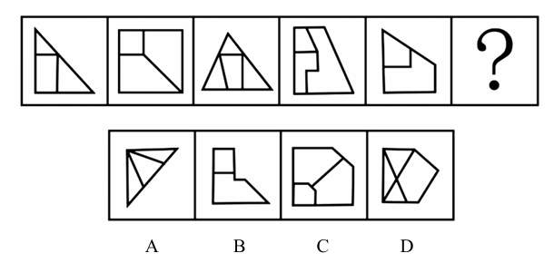

# 错题 15：图形推理-数量类-面（最小面形状）

**来源**：决战行测5000题（上册）- 数量规律-面 - 夯实基础第10题

点击查看答案

<b>你的答案</b>：B 
<b>正确答案</b>：C  
<b>详细解答</b>： 元素组成不同，且无明显属性规律，考虑数量规律。观察发现，题干图形被分割、封闭区域明显，考虑面数量。整体数面无规律，继续观察发现，题干图形均有最小面，且最小面的形状和图形外框形状一致，只有C项符合。故正确答案为C。  
<b>错误原因</b>：未关注最小面形状

