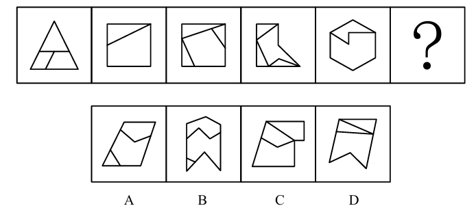

# 错题 16：图形推理-数量类-面（面积相等）

**来源**：决战行测5000题（上册）- 数量规律-面 - 夯实基础第11题

点击查看答案

<b>你的答案</b>：B 
<b>正确答案</b>：D  
<b>详细解答</b>： 元素组成不同，且属性规律无唯一答案，考虑数量规律。题干图形均为多边形内部被分割，"窟窿"比较明显，考虑面数量。第一组图形的面数量依次为2、4、6，第二组图形的面数量依次为4、6、？，故问号处应选择一个有8个面的图形，排除A、C两项。整体数面选不出唯一答案，考虑面的细化考法。观察发现，题干已知每幅图形被分割成的所有面的面积相等，只有D项符合。  
<b>错误原因</b>：凭直觉认为B内部面积相等，而D不相等。实则不然

