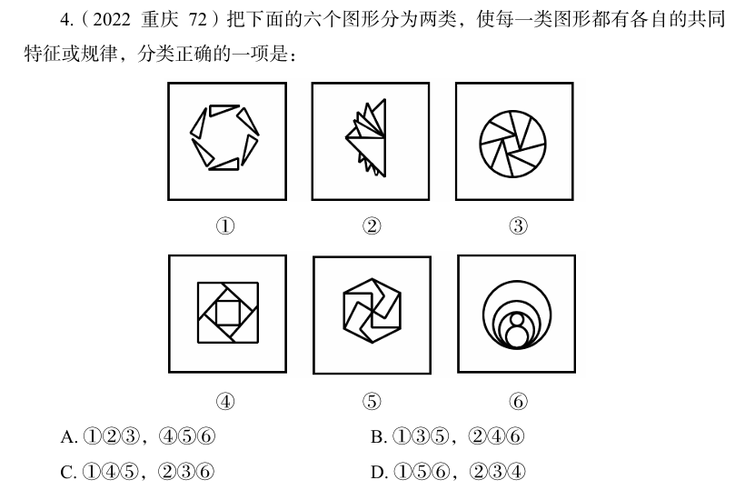

# 错题 17：图形推理-数量类-面（分组分类）

**来源**：决战行测5000题（上册）- 数量规律-面 - 高难进阶第2题

点击查看答案

<b>你的答案</b>：B 
<b>正确答案</b>：D  
<b>详细解答</b>： 本题为分组分类题目。元素组成不同，且无明显属性规律，考虑数量规律。观察发现，题干图形被分割、封闭区域明显，考虑面数量。图②③④均有9个面，故图①⑤⑥为一组，图②③④为一组。  
<b>错误原因</b>：图⑤错数成7个面，导致未发现面数规律

