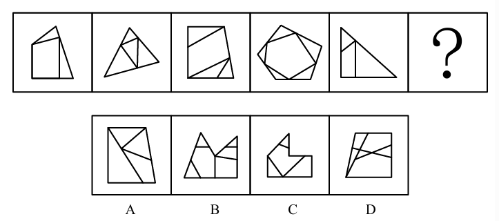

# 错题 18：图形推理-数量类-面（最大面边数=外框边数）

**来源**：决战行测5000题（上册）- 数量规律-面 - 夯实基础第12题

点击查看答案

<b>你的答案</b>：— 
<b>正确答案</b>：C  
<b>详细解答</b>： 元素组成不同，且无明显属性规律，考虑数量规律。观察发现，题干图形被分割、封闭区域明显，考虑面数量。题干已知图形的面数量依次为3、4、4、6、3，无规律，考虑面的细化。继续观察发现，题干已知图形均存在明显的最大面，且最大面与其所在图形外框的边数量相同，只有C项符合。  
<b>错误原因</b>：未考虑最大面的性质，未发现其边数和整体图形边数相等这一规律

