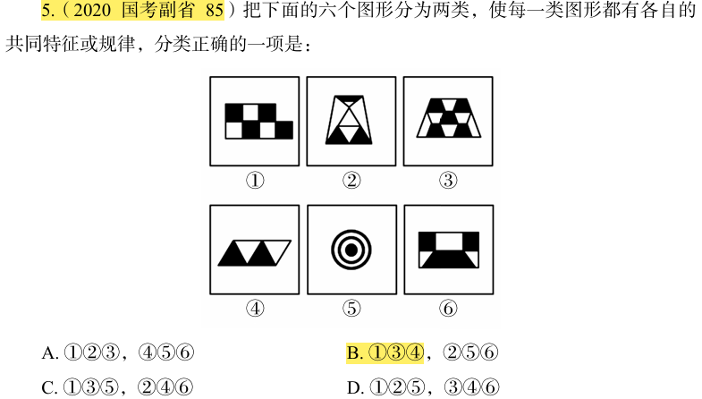

# 错题 19：图形推理-样式类-黑白块（黑块形状种类）

**来源**：决战行测5000题（上册）- 样式规律-黑白块 - 高难进阶第3题

点击查看答案

<b>你的答案</b>：— 
<b>正确答案</b>：B  
<b>详细解答</b>： 本题为分组分类题目。元素组成不同，且无明显属性规律，考虑数量规律。观察发现，题干图形中出现黑白块元素，考虑黑白块的种类或数量。形状只有正方形一种，图②中黑块形状有梯形和三角形两种，图③中黑块形状只有梯形一种，图④中黑块形状只有三角形一种，图⑤中黑块形状有圆和圆环两种，图⑥中黑块形状有矩形和梯形两种。所以，可以根据黑块形状是一种还是两种分为两组，图①③④为一组，图②⑤⑥为一组。  
<b>错误原因</b>：没有认识到圆形和圆环是两种不同的形状，不同形状的梯形可看做一种形状

