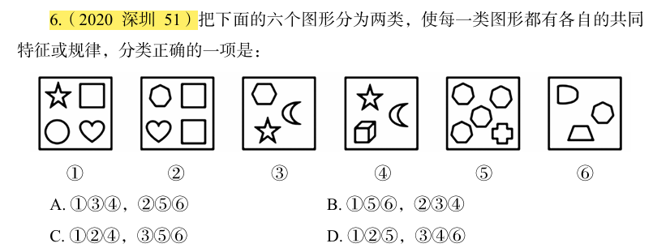

# 错题 20：图形推理-样式类-相同元素（分组分类）

**来源**：决战行测5000题（上册）- 样式规律-相同元素 - 夯实基础第5题

点击查看答案

<b>你的答案</b>：— 
<b>正确答案</b>：A  
<b>详细解答</b>： 本题为分组分类题目。元素组成不同，且无明显属性规律，考虑数量规律。观察发现，题干每幅图均由多个元素组成，且多幅图之间存在相同元素，因此可以考虑找相同元素。图①③④中均存在相同元素"五角星"，图②⑤⑥中均存在相同元素"七边形"，故图①③④为一组，图②⑤⑥为一组。故正确答案为A。  
<b>错误原因</b>：未找到共性元素五角星和七边形

