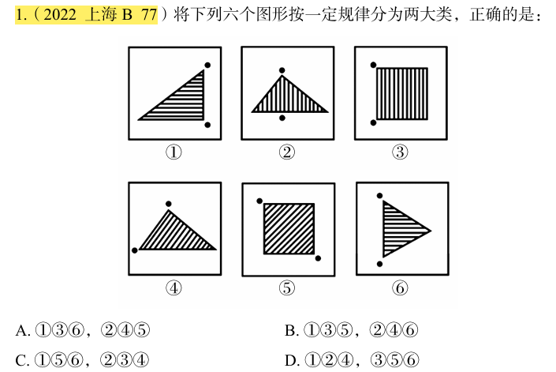

# 错题 21：图形推理-功能元素-小黑点连线与内部线条关系（分组分类）

**来源**：决战行测5000题（上册）- 功能元素 - 高难进阶第1题

点击查看答案

<b>你的答案</b>：— 
<b>正确答案</b>：C  
<b>详细解答</b>： 本题为分组分类题目。观察发现，题干图形都有两个小黑点，优先考虑功能元素。将题干图形的两个小黑点进行连线后发现，图①⑤⑥中两个小黑点的连线与图形内部线条方向垂直，图②③④中两个小黑点的连线与图形内部线条方向平行，故图①⑤⑥为一组，图②③④为一组。  
<b>错误原因</b>：忽视了阴影线条的方向性，导致未发现规律

