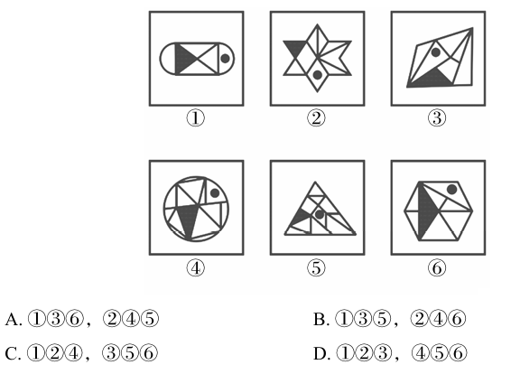

# 错题 22：图形推理-功能元素-小黑点与阴影三角形位置关系（分组分类）

**来源**：决战行测5000题（上册）- 功能元素 - 夯实基础第6题

点击查看答案

<b>你的答案</b>：— 
<b>正确答案</b>：C  
<b>详细解答</b>： 观察发现，题干每幅图均有一个小黑点和一个阴影三角形，考虑小黑点与阴影三角形之间的关系。图①②④中小黑点所在的面与阴影三角形没有公共边/公共点，图③⑤⑥中小黑点所在的面与阴影三角形有公共边/公共点，故图①②④为一组，图③⑤⑥为一组。  
<b>错误原因</b>：只看公共边或公共点，而没有既看公共边又看公共点

