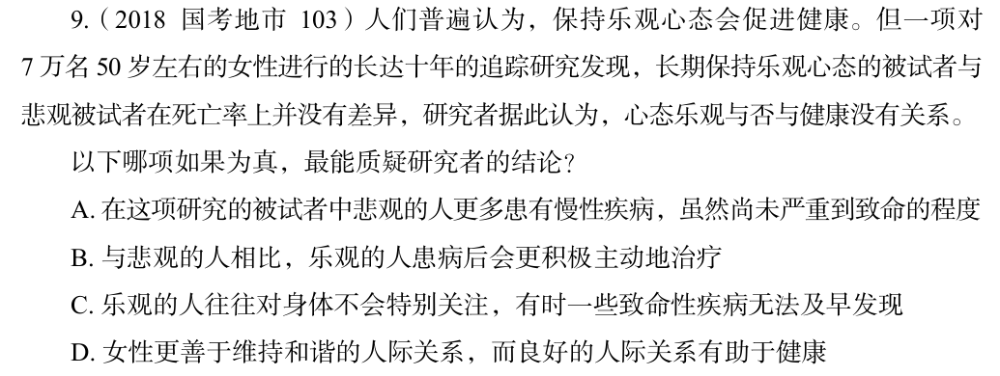

# 错题 27：判断推理-削弱论证

点击查看答案

<b>你的答案</b>：C 
<b>正确答案</b>：A  
<b>详细解答</b>： A项：被试者中悲观的人更多患有慢性疾病，虽然尚未严重到致命的程度，说明虽然死亡率无差异，但不等同于是健康的，切断了论据和论点的关系，属于拆桥项，当选。C项：乐观的人对身体健康不特别关注，会有一些疾病无法及早发现，但疾病是否及早发现与论点中说的是否健康无关，为无关项，不能削弱，排除。  
<b>错误原因</b>：未意识到身体健康并不等同于死亡率

