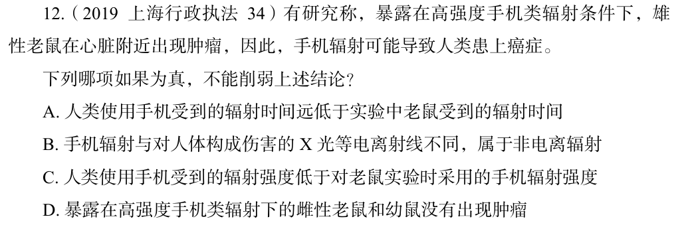

# 错题 28：判断推理-削弱论证

点击查看答案

<b>你的答案</b>：D 
<b>正确答案</b>：B  
<b>详细解答</b>： B项：该项指出手机辐射与对人体构成伤害的X光等电离射线不同，属于非电离辐射，但不明确非电离辐射是否会导致人类患上癌症，为不明确项，无法削弱，当选。D项：该项指出暴露在高强度手机类辐射下的雌性老鼠和幼鼠没有出现肿瘤，补充了反面论据，说明实验不全面，可以削弱，排除。  
<b>错误原因</b>：忽略了不明确选项

