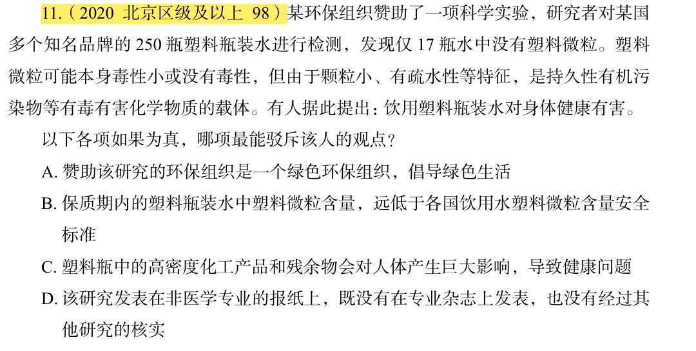

# 错题 31：判断推理-削弱论证

点击查看答案

<b>你的答案</b>：D 
<b>正确答案</b>：B  
<b>详细解答</b>： B是拆桥项，切断了"塑料微粒存在"与"对身体健康有害"之间的联系，指出含量远低于安全标准，直接否定了有害的结论。D不明确，仅说明研究发表渠道和未经核实，但并不能直接否定研究结论本身。  
<b>错误原因</b>：高估了D的质疑力，忽视了更有质疑力的B

