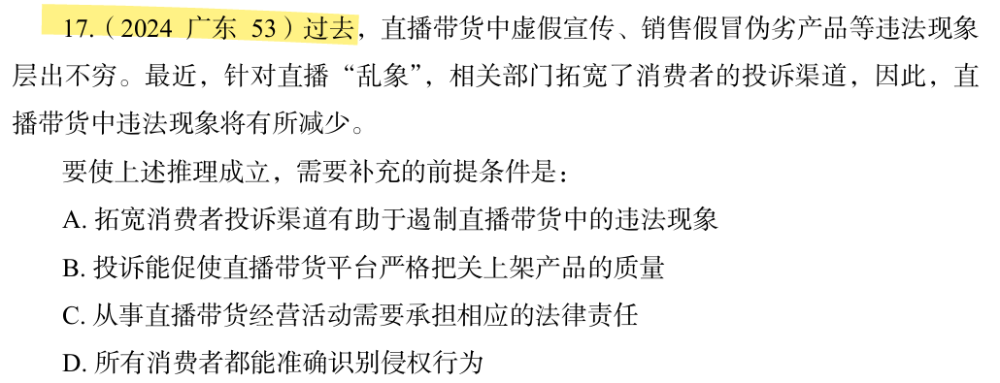

# 错题 34：逻辑判断-加强型论证（搭桥）

**来源**：用户上传题目

点击查看答案

<b>你的答案</b>：B 
<b>正确答案</b>：A  
<b>详细解答</b>： 
论点讨论的是"直播带货中违法现象将有所减少"，论据讨论的是"相关部门拓宽了消费者的投诉渠道"，二者话题不一致，加强优先考虑搭桥，即在"拓宽投诉渠道"与"违法现象减少"之间建立联系。A为搭桥项，当选。B话题不一致，排除。  
<b>错误原因</b>：
以为A项是重复题干，实则题干的论点和论据并没有强联系，需要搭桥

