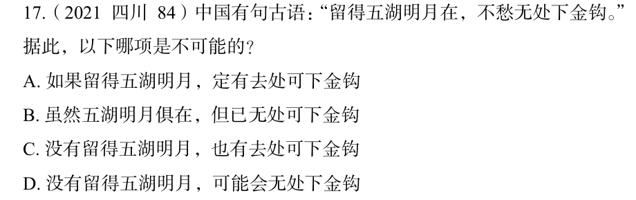

# 错题 35：逻辑判断-模态命题与充分条件假言推理

**来源**：逻辑推理练习题

点击查看答案

<b>你的答案</b>：A 
<b>正确答案</b>：B  
<b>详细解答</b>： 

<strong>题干分析：</strong> 
古语"留得五湖明月在，不愁无处下金钩"的逻辑形式为： 
<strong>P → Q</strong>（留得五湖明月 → 有处下金钩） 
即"留得五湖明月"是"有处下金钩"的充分条件。  

<strong>矛盾关系：</strong> 
充分条件假言命题 P→Q 的矛盾命题是：<strong>P ∧ ¬Q</strong>（P成立且Q不成立） 
对应本题为："留得五湖明月"且"无处可下金钩"  

<strong>选项分析：</strong> 
- A. "如果留得五湖明月，定有处可下金钩" → P→Q，与题干一致，是可能的 
- B. "虽然五湖明月俱在，但已无处可下金钩" → P∧¬Q，与题干矛盾，<strong>是不可能的</strong> 
- C. "没有留得五湖明月，也有去处可下金钩" → ¬P∧Q，与题干不矛盾，是可能的 
- D. "没有留得五湖明月，可能会无处下金钩" → ¬P→¬Q可能成立，是可能的  

<b>错误原因</b>：错选A是因为把题干的"哪项是<strong>不可能的</strong>"看成了"哪项是<strong>可能的</strong>"，导致完全相反的答案。模态词"不可能"应找出与题干矛盾（即P∧¬Q）的选项，而非与题干一致的选项。  

<strong>核心知识点：</strong> 
1. 充分条件 P→Q 的矛盾命题是 P∧¬Q（肯定前件且否定后件） 
2. 注意审题：题目问"不可能"就是要找矛盾项，而非符合项 
3. 避免粗心：看清题干的模态词（可能/不可能）再作答

