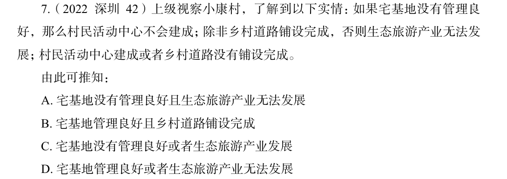

# 错题 36：逻辑判断-翻译推理

**来源**：2022 深圳 42

点击查看答案

<b>你的答案</b>：B 
<b>正确答案</b>：D  
<b>详细解答</b>： 第一步：翻译题干。（1）–宅基地管理良好→–村民活动中心建成；（2）生态旅游产业发展→乡村道路铺设完成；（3）村民活动中心建成或–乡村道路铺设完成。第二步：根据题干条件进行推理。条件（3）是相对比较确定的信息，可以从条件（3）入手。"或"关系成立，表示由"或"连接的所有对象至少有一个成立，故条件（3）中的"村民活动中心建成"和"–乡村道路铺设完成"至少有一项为真。当"村民活动中心建成"为真时，根据条件（1）否后必否前可知，"宅基地管理良好"为真；当"–乡村道路铺设完成"为真时，根据条件（2）否后必否前可知，"–生态旅游产业发展"为真。由于"村民活动中心建成"和"–乡村道路铺设完成"至少有一项为真，因此"宅基地管理良好"和"–生态旅游产业发展"至少有一项为真，即"宅基地管理良好"或"–生态旅游产业发展"，对应D项。  
<b>错误原因</b>：看到B可以成立就选了，而没有从题干出发推导最合适的选项。

