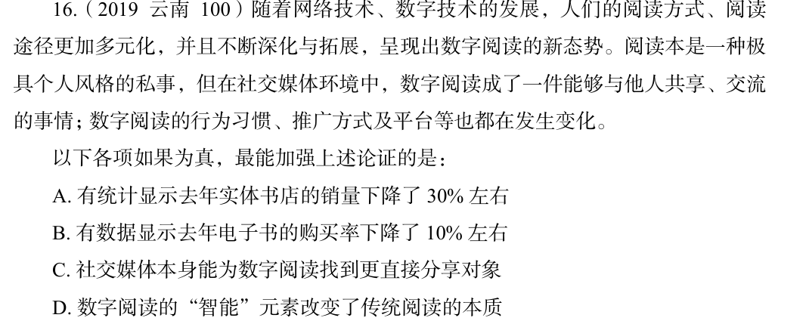

# 错题 40：判断推理-逻辑判断-加强论证

**来源**：

点击查看答案

<b>你的答案</b>：A 
<b>正确答案</b>：C  
<b>详细解答</b>： 论点：在社交媒体环境中，数字阅读成了一件能够与他人共享、交流的事情；数字阅读的行为习惯、推广方式及平台等也都在发生变化。 论据：无。 本题只有论点，没有论据，加强优先考虑补充论据。  第二步：逐一分析选项。 A项：只说明去年实体书店的销量下降了，没有提及社交媒体对数字阅读的影响，属于无关项，排除。 B项：说明去年电子书的购买率下降了，而论点说的是社交媒体使数字阅读成为一件可共享、交流的事情，属于无关项，排除。 C项：说明社交媒体可以让数字阅读成为一件能共享的事情，补充论据，可以加强，当选。 D项：说明数字阅读改变了传统阅读的本质，但论点说的是社交媒体使数字阅读成为一件可共享、交流的事情，话题不一致，无法加强，排除。 故正确答案为C。  
<b>错误原因</b>：略

