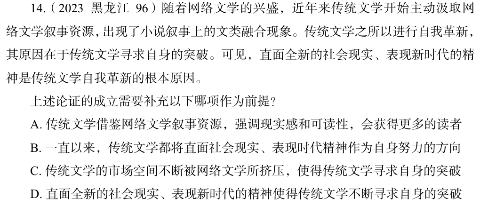

# 错题 41：判断推理-逻辑判断-加强论证-搭桥

**来源**：

点击查看答案

<b>你的答案</b>：B 
<b>正确答案</b>：D  
<b>详细解答</b>： 论点：直面全新的社会现实、表现新时代的精神是传统文学自我革新的根本原因。论据：传统文学之所以进行自我革新，其原因在于传统文学寻求自身的突破。本题论点说的是传统文学自我革新的根本原因是"直面全新的社会现实、表现新时代的精神"，论据说的是传统文学进行自我革新的原因是"寻求自身的突破"，二者话题不一致，加强优先考虑搭桥，即建立"直面全新的社会现实、表现新时代的精神"与"寻求自身的突破"之间的联系。  第二步：逐一分析选项。 A项：该项说的是传统文学借鉴网络文学的好处，论点说的是传统文学进行自我革新的根本原因，话题不一致，无法加强，排除。 B项：该项说的是传统文学的努力方向，论点说的是传统文学进行自我革新的根本原因，话题不一致，无法加强，排除。 C项：该项说的是传统文学寻求自身突破的原因，论点说的是传统文学进行自我革新的根本原因，话题不一致，无法加强，排除。 D项：该项说的是直面全新的社会现实、表现新时代的精神使得传统文学不断寻求自身的突破，建立了论据和论点之间的联系，为搭桥项，可以加强，当选。 故正确答案为D。  
<b>错误原因</b>：没找论点和论据间的搭桥项

