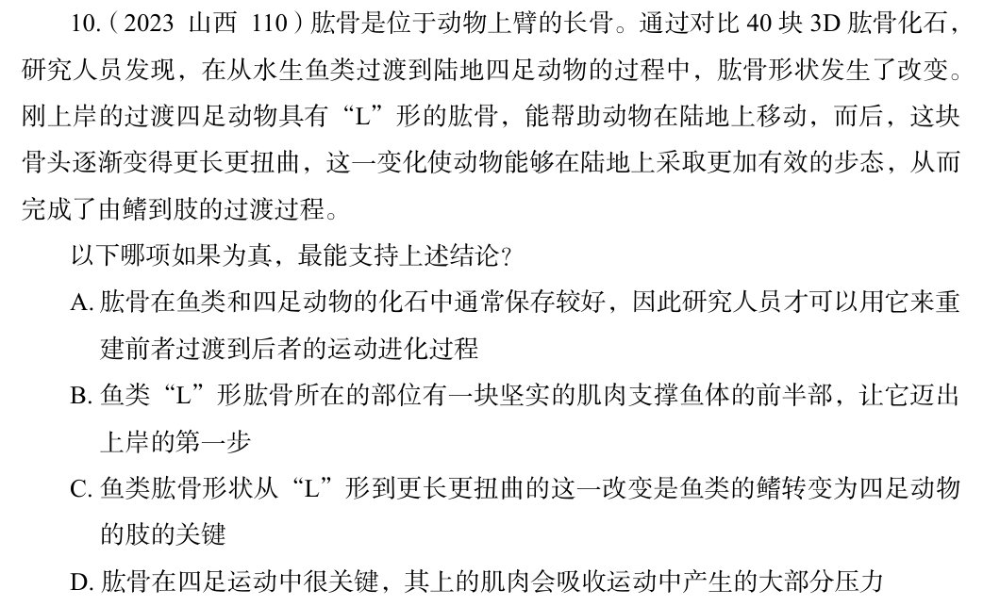

# 错题 42：判断推理-逻辑判断-加强论证-搭桥

**来源**：

点击查看答案

<b>你的答案</b>：D 
<b>正确答案</b>：C  
<b>详细解答</b>： C项：该项指出鱼类肱骨形状从"L"形到更长更扭曲的这一改变是鱼类的鳍转变为四足动物的肢的关键，解释了为什么肱骨形状发生改变使动物能够在陆地上采取更加有效的步态，从而完成了由鳍到肢的过渡过程，补充论据。  
<b>错误原因</b>：没找到论据和论点并发现搭桥项

