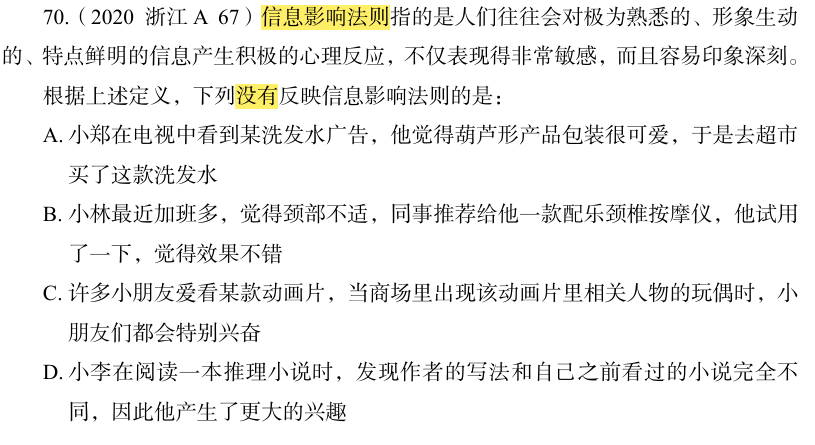

# 错题 43：判断推理-信息影响法则

**来源**：行测定义判断题

点击查看答案

<b>你的答案</b>：D 
<b>正确答案</b>：B  
<b>详细解答</b>： 
<strong>信息影响法则</strong>定义：人们往往会对<strong>极为熟悉的、形象生动的、特点鲜明的信息</strong>产生积极的心理反应，不仅表现得非常敏感，而且容易印象深刻。

<strong>选项分析：</strong>
<ul>
<li><strong>A项</strong>：小郑对葫芦形产品包装（形象生动、特点鲜明的信息）产生积极反应（觉得可爱），符合定义。</li>
<li><strong>B项</strong>：小林使用按摩仪是基于同事推荐和试用效果，并非因为按摩仪具有"极为熟悉、形象生动或特点鲜明的信息"，<strong>不符合定义</strong>。</li>
<li><strong>C项</strong>：小朋友对动画片人物玩偶（极为熟悉、形象生动的信息）产生积极反应（特别兴奋），符合定义。</li>
<li><strong>D项</strong>：小李对与众不同的写法（特点鲜明的信息）产生更大兴趣，符合定义。</li>
</ul>

<strong>错误原因</strong>：认为D选项不符合"极为熟悉的信息"，实则推理小说这一大类是符合的。对"极为熟悉"的理解过于狭隘，忽略了"推理小说"作为整体类别对读者而言是"极为熟悉"的，而"与众不同的写法"又构成了"特点鲜明的信息"。  

