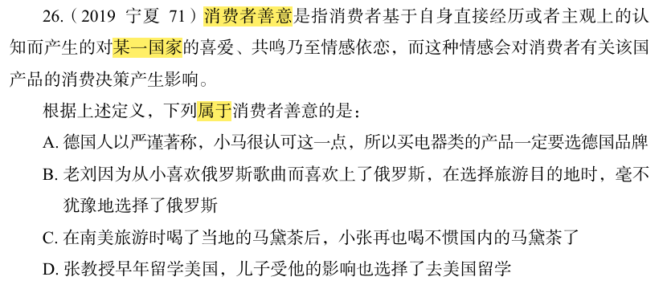

# 错题 44：判断推理-消费者善意

**来源**：行测定义判断题

点击查看答案

<b>你的答案</b>：B 
<b>正确答案</b>：A  
<b>详细解答</b>： 
<strong>消费者善意</strong>定义：消费者基于自身直接经历或者主观上的认知而产生的对<strong>某一国家</strong>的喜爱、共鸣乃至情感依恋，而这种情感会对消费者有关<strong>该国产品</strong>的消费决策产生影响。

<strong>关键要素：</strong>
<ol>
<li>对<strong>某一国家</strong>的喜爱/情感依恋</li>
<li>这种情感影响对<strong>该国产品</strong>的消费决策</li>
</ol>

<strong>选项分析：</strong>
<ul>
<li><strong>A项</strong>：小马认可德国人的严谨态度（基于主观认知产生对德国的正面情感），买电器选德国品牌（影响对该国产品的消费决策），<strong>符合定义</strong>。</li>
<li><strong>B项</strong>：老刘喜欢俄罗斯歌曲而喜欢俄罗斯（符合"对国家的喜爱"），选择俄罗斯作为旅游目的地（但旅游不属于"对该国产品的消费决策"），<strong>不符合定义</strong>。</li>
<li><strong>C项</strong>：小张喜欢南美马黛茶，这是对产品的偏好，而非对国家的情感，不符合定义。</li>
<li><strong>D项</strong>：儿子受父亲影响选择美国留学，不是基于自身对美国的情感依恋，且留学不属于产品消费，不符合定义。</li>
</ul>

<strong>错误原因</strong>：认为A项只是认可德国人的某项品质，不算喜爱德国。实际上，"认可严谨态度"正是基于主观认知产生的对德国的正面情感，且明确影响了对德国电器产品的消费决策，完全符合定义。  
</ul>

