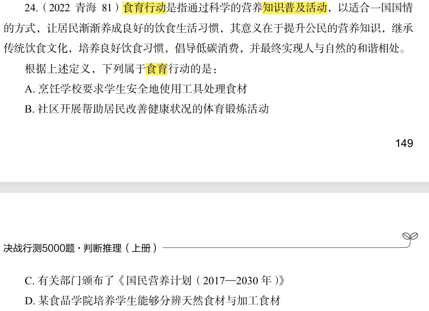

# 错题 46：判断推理-投射效应

**来源**：行测定义判断题

点击查看答案

<b>你的答案</b>：B 
<b>正确答案</b>：D  
<b>详细解答</b>： 
<strong>投射效应</strong>定义：把自己的主观愿望投射于他人，认为他人也具备与自己相似的特征。

<strong>关键要素：</strong>
<ol>
<li><strong>自己的主观愿望/想法</strong></li>
<li><strong>投射于他人</strong>——认为他人也有同样的想法</li>
</ol>

<strong>选项分析：</strong>
<ul>
<li><strong>A项</strong>："人无我有，人有我优"——强调产品竞争优势和独特性，是市场竞争策略，不涉及"把自己的想法投射于他人"，不符合定义。</li>
<li><strong>B项</strong>："世上本无事，庸人自扰之"——指自己无事生非、自找麻烦，是自我困扰，不涉及"投射于他人"，不符合定义。</li>
<li><strong>C项</strong>："别人笑我太疯癫，我笑他人看不穿"——表达的是自己对世俗的超脱和他人的不理解，是自我认知与他人认知的差异，不涉及"把自己的想法投射于他人"，不符合定义。</li>
<li><strong>D项</strong>："我之所虑，人之所想"——意思是我所考虑的就是别人所想的，<strong>把自己的主观愿望投射于他人</strong>，认为他人与自己有相同的想法，<strong>符合定义</strong>。</li>
</ul>

<strong>错误原因</strong>：对"投射效应"定义理解不准确，未能准确把握"把自己的主观愿望投射于他人"这一核心要素。  

<strong>核心要点</strong>：
<ul>
<li>投射效应的关键是<strong>"以己度人"</strong>——把自己的想法、愿望、情感等投射到他人身上</li>
<li>要区分"自我困扰""自我认知"与"投射于他人"的不同</li>
<li>选项中的俗语需要准确理解其含义，不能望文生义</li>
</ul>

