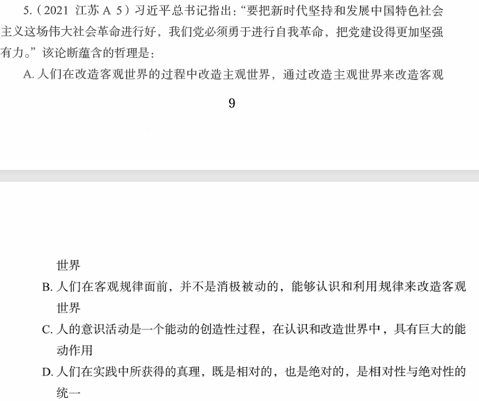

# 错题 48：马克思主义哲学-主观世界与客观世界的关系

**来源**：政治理论题

点击查看答案

<b>你的答案</b>：C 
<b>正确答案</b>：A  
<b>详细解答</b>： 
<strong>题干核心</strong>：习近平总书记指出，要把新时代坚持和发展中国特色社会主义这场伟大社会革命进行好，我们党必须勇于进行自我革命，把党建设得更加坚强有力。

<strong>关键信息提取</strong>：
<ol>
<li>"自我革命"——<strong>改造主观世界</strong>（党的建设、自身提升）</li>
<li>"社会革命"——<strong>改造客观世界</strong>（坚持和发展中国特色社会主义）</li>
<li>通过自我革命来更好地进行社会革命——<strong>通过改造主观世界来改造客观世界</strong></li>
</ol>

<strong>选项分析：</strong>
<ul>
<li><strong>A项</strong>：人们在改造客观世界的过程中改造主观世界，通过改造主观世界来改造客观世界——<strong>完全符合</strong>题干中"自我革命"（改造主观）推动"社会革命"（改造客观）的辩证关系。</li>
<li><strong>B项</strong>：人在客观规律面前并不是无能为力的，可以认识和利用规律——题干未涉及"客观规律"的内容，<strong>排除</strong>。</li>
<li><strong>C项</strong>：人的意识活动具有巨大的能动作用，具有创造性——虽然有一定道理，但题干强调的是<strong>主观世界的改造</strong>而非单纯的"意识活动"，<strong>不够精准</strong>。</li>
<li><strong>D项</strong>：真理是绝对性和相对性的统一——题干未涉及"真理"的内容，<strong>排除</strong>。</li>
</ul>

<strong>错误原因</strong>：被"意识的能动作用"迷惑，未能准确把握题干核心是"通过改造主观世界来改造客观世界"的辩证关系。虽然C项提到的意识能动性在哲学上正确，但与题干的哲理指向不完全吻合。  

<strong>核心要点</strong>：
<ul>
<li><strong>主观世界与客观世界的辩证关系</strong>：人在改造客观世界的同时，也需要改造主观世界；通过改造主观世界，可以更有效地改造客观世界</li>
<li>"自我革命"是典型的<strong>改造主观世界</strong>的表述</li>
<li>"社会革命"是典型的<strong>改造客观世界</strong>的表述</li>
<li>做题时要抓住题干的<strong>核心对应关系</strong>，而非被表面相似的哲学概念迷惑</li>
</ul>

