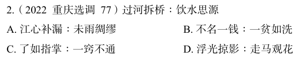

# 错题 49:言语理解-类比推理-成语关系

**来源**:2022 重庆选调 77

点击查看答案

<b>你的答案</b>:C 
<b>正确答案</b>:A  
<b>详细解答</b>: "过河拆桥"比喻达到目的以后,就把曾经帮助过自己的人一脚踢开;"饮水思源"比喻人在幸福的时候不忘幸福的来源。二者为反义关系,且"过河拆桥"为贬义词,"饮水思源"为褒义词。A项:"江心补漏"比喻事先不防备,临时补救,无济于事;"未雨绸缪"比喻事先做好准备。二者为反义关系,且"江心补漏"为贬义词,"未雨绸缪"为褒义词,与题干逻辑关系一致,当选。C项:"了如指掌"形容对情况非常清楚;"一窍不通"比喻一点儿也不懂。二者为反义关系,但"了如指掌"为褒义词,"一窍不通"为贬义词,与题干逻辑关系不一致,排除。  
<b>错误原因</b>:只注意到反义词,未注意到褒贬义关系。

