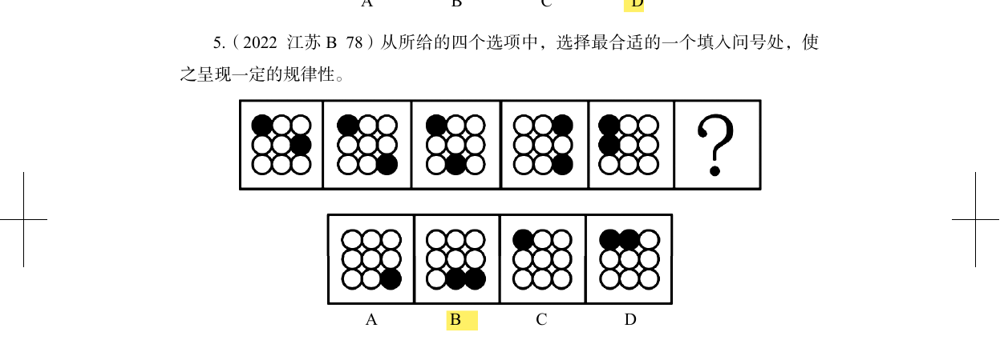

# 错题 5：图形推理-位置类-复杂九宫格平移

**来源**：决战行测5000题（上册）高难进阶第5题

点击查看答案

<b>你的答案</b>：B 
<b>正确答案</b>：A  
<b>详细解答</b>： 元素组成相同，优先考虑位置规律。观察发现，题干图形中两个黑球一直沿九宫格的外圈进行平移。  把两个黑球分别用1、2标记，按照就近原则进行追踪： - 黑球1沿外圈每次顺时针/逆时针平移4格 - 黑球2沿外圈每次逆时针平移3格  根据此规律，最终两个黑球均平移至九宫格右下角，对应<b>A项</b>。  
<b>错误原因</b>：步数计算错误

