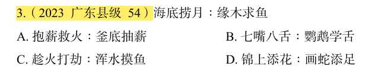

# 错题 50:言语理解-类比推理-成语关系

**来源**:2023 广东县级 54

点击查看答案

<b>你的答案</b>:D 
<b>正确答案</b>:C  
<b>详细解答</b>: "海底捞月"比喻根本做不到,白费力气;"缘木求鱼"比喻方向、方法不对,一定达不到目的。二者为近义关系。C项:"趁火打劫"指趁紧张危急的时候侵犯别人的权益;"浑水摸鱼"比喻趁混乱的时机捞取利益。二者为近义关系,与题干逻辑关系一致,当选。  
<b>错误原因</b>:误以为锦上添花是画蛇添足的近义词,实则不是

