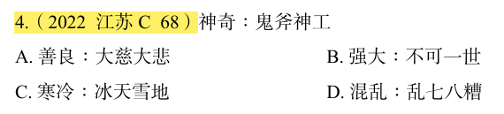

# 错题 51:言语理解-类比推理-词语关系

**来源**:2022 江苏 C 68

点击查看答案

<b>你的答案</b>:A 
<b>正确答案</b>:C  
<b>详细解答</b>: "鬼斧神工"形容建筑、雕塑等技艺的精巧,与"神奇"构成近义关系。且"鬼斧神工"用夸张的修辞手法来表示"神奇",程度加深。C项:"冰天雪地"形容非常寒冷,与"寒冷"构成近义关系,且"冰天雪地"用夸张的修辞手法来表示"寒冷",程度加深,与题干逻辑关系一致,当选。  
<b>错误原因</b>:未发现夸张的修辞手法,误认为解题关键是褒贬义

