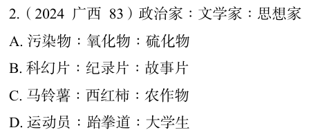

# 错题 54：判断推理-类比推理-交叉关系

**来源**：

点击查看答案

<b>你的答案</b>：A 
<b>正确答案</b>：B  
<b>详细解答</b>： "政治家""文学家""思想家"是人的三种不同身份，三者互为交叉关系。  
第二步：判断选项词语间逻辑关系。 
A项："氧化物"与"硫化物"为并列关系，二者分别与"污染物"构成交叉关系，与题干逻辑关系不一致，排除。 
B项："科幻片""纪录片""故事片"是对影视作品从三个不同的角度进行的划分，三者互为交叉关系，与题干逻辑关系一致，当选。  
<b>错误原因</b>：认为科幻片和纪录片并列，氧化物和硫化物不并列

