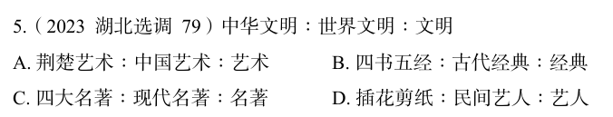

# 错题 55：判断推理-类比推理-种属与组成关系

**来源**：

点击查看答案

<b>你的答案</b>：B 
<b>正确答案</b>：A  
<b>详细解答</b>： "中华文明"是"世界文明"的一个组成部分，二者为组成关系；"世界文明"是"文明"的一种，二者为种属关系。  
第二步：判断选项词语间逻辑关系。 
A项：荆楚古时包括现今湖北全域及其周围，现指湖北省。"荆楚艺术"是"中国艺术"的一个组成部分，二者为组成关系；"中国艺术"是"艺术"的一种，二者为种属关系。与题干逻辑关系一致，当选。 
B项："四书五经"是我国的"古代经典"，二者为种属关系，与题干逻辑关系不一致，排除。  
<b>错误原因</b>：未能正确区分种属和组成关系

