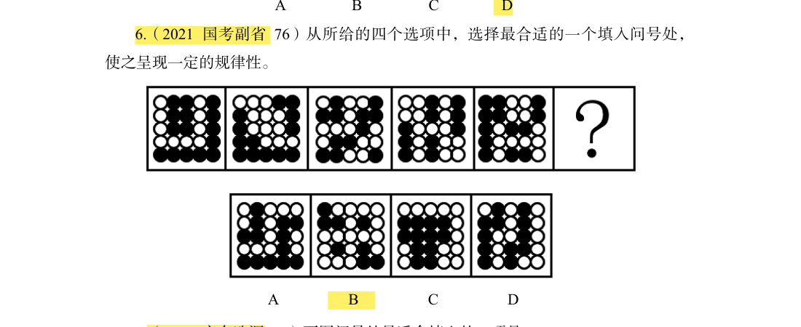

# 错题 6：图形推理-属性类-对称性-高难进阶

**来源**：决战行测5000题（上册）对称性-高难进阶第6题（2021 国考副省 76）

点击查看答案

<b>你的答案</b>：B 
<b>正确答案</b>：A  
<b>详细解答</b>： <b>题干已知图形的白球组成区域出现"等腰"特征</b>，优先考虑白球组成区域的对称性。题干已知图形的白球组成区域依次是轴对称图形、中心对称图形、轴对称图形、中心对称图形、轴对称图形，因此问号处图形的白球组成区域应为中心对称图形。A项图形的白球组成区域为中心对称图形，当选。B项图形的白球组成区域为轴对称图形，C、D两项图形的白球组成区域不是对称图形，均排除。  
<b>错误原因</b>：只注意黑球形状，没注意白球

