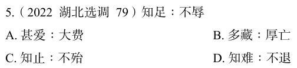

# 错题 62：行测-判断推理-类比推理

点击查看答案

<b>你的答案</b>：D 
<b>正确答案</b>：C  
<b>详细解答</b>： 
"知足不辱"的意思是知道满足，就不会受到羞辱。因为"知足"，所以"不辱"二者是因果对应关系，且"不辱"是积极的结果。
C项:"知止不殆"的意思是知道适可而止就不会遇到危险。因为"知止"，所以"不殆"，二者是因果对应关系，且"不殆"是积极的结果，与题干逻辑关系一致，当选。
D项:"知难不退"的意思是碰到困难也不退缩。"知难"与"不退"不是因果对应关系，与题干逻辑关系不一致，排除。
  
<b>错误原因</b>：未发现知足不辱的因果关系

