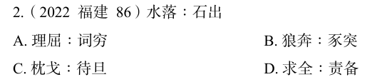

# 错题 63：行测-判断推理-类比推理

点击查看答案

<b>你的答案</b>：B 
<b>正确答案</b>：A  
<b>详细解答</b>： 
第一步:判断题干词语间逻辑关系。
因为水落下去，所以石头露出来，"水落"导致"石出"，二者为因果关系。
第二步:判断选项词语间逻辑关系。
A项:因为理由不足，所以无话可说，"理屈"导致"词穷"，二者为因果关系与题干逻辑关系一致，当选。
B项:"狼奔"指像狼一样奔跑，"豕突"指像猪一样冲撞，二者为并列关系，与题干逻辑关系不一致，排除。
  
<b>错误原因</b>：未发现因果关系，而误以为是时间先后关系

