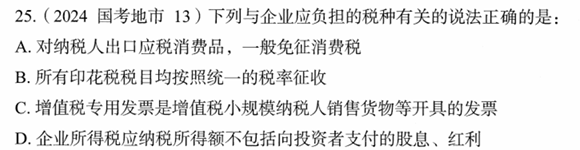

# 错题 65：行测-常识判断-经济知识

点击查看答案

<b>你的答案</b>：D 
<b>正确答案</b>：A  
<b>详细解答</b>： 
A项正确:《中华人民共和国消费税暂行条例》第十一条规定:"对纳税人出口应税消费品，免征消费税;国务院另有规定的除外。出口应税消费品的免税办法，由国务院财政、税务主管部门规定。"
D项错误：《中华人民共和国企业所得税法》第十条规定:"在计算应纳税所得额时，下列支出不得扣除:(一)向投资者支付的股息、红利等权益性投资收益款项"
  
<b>错误原因</b>：知识盲区

