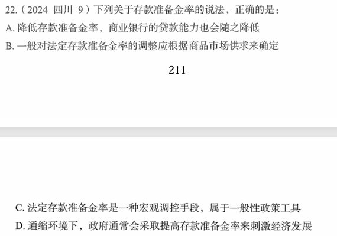

# 错题 67：行测-常识判断-经济知识

点击查看答案

<b>你的答案</b>：B 
<b>正确答案</b>：C  
<b>详细解答</b>： 
B项错误：中国的存款准备金率由央行根据银行的经营状况、资金供给情况及世界银行等多种因素确定。
C项正确：法定存款准备金率属于宏观调控的经济手段中的货币政策。其中一般性货币政策工具是指中央银行所采用的、对整个金融系统的货币信用扩张与紧缩会产生全面性或一般性影响的手段，是最主要的货币政策工具，主要包括法定存款准备金率、再贴现政策和公开市场业务。
  
<b>错误原因</b>：知识盲区

