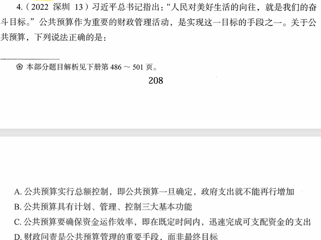

# 错题 68：行测-常识判断-经济知识

点击查看答案

<b>你的答案</b>：D 
<b>正确答案</b>：B  
<b>详细解答</b>： 
B项正确：预算研究者艾伦·希克把公共预算的职能分为三种：计划、管理、控制。
D项错误：公共预算的最终目标是财政问责。它是公共预算应承担的受托责任，是指政府的财政活动应履行其对公民和社会的承诺，真正做到"取之于民，用之于民"。
  
<b>错误原因</b>：知识盲区

