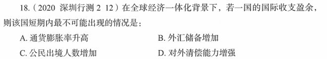

# 错题 70：行测-常识判断-经济知识

点击查看答案

<b>你的答案</b>：A 
<b>正确答案</b>：C  
<b>详细解答</b>： 
国际收支盈余是指在一定时期内(通常为一年)，一个国家对外经济往来的收入总额大于支出总额的差额，即顺差。
A项正确:一国的国际收支盈余会造成该国国际储备增加，货币供应增加，物价上升，加剧通货膨胀。
B项正确:一国的国际收支盈余增强了综合国力，有利于维护国际信誉，提高对外融资能力，增加外汇储备。
C项错误:公民出境受到多种因素影响，如国家政策、安全因素、汇率因素、交通成本、闲暇时间等。国际收支盈余虽然意味着国民收入有所增长，会对公民出境产生一定积极影响，但综合考虑，短期内出境人数增加是最不可能出现的情况。
D项正确:一国的国际收支盈余，本币趋于升值，对外偿还债务的能力增强。
  
<b>错误原因</b>：误以为外汇储备增加不会导致通胀率提高

