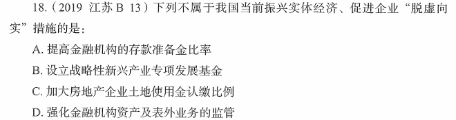

# 错题 71：经济-存款准备金率

**来源**：

点击查看答案

<b>你的答案</b>：C 
<b>正确答案</b>：A  
<b>详细解答</b>： A项错误：存款准备金率是指金融机构为保证客户提取存款和资金清算需要而准备的在中央银行的存款比例。提高存款准备金率是应对通货膨胀的措施，其调节经济的基本逻辑为：提高存款准备金率→银行用于贷款的货币减少→货币供应量减少→抑制通货膨胀。银行用于贷款的货币减少，经济实体投资缩小，不利于发展实体经济。  
C项正确：认缴比例是投资者出的钱在投资总额中占的比重。加大房地产企业土地使用金认缴比例即要求投资者在开发房地产方面要投入更多的资金，金融、房地产、互联网从某种意义上来说都是为实体经济服务的，其发展水平必须与实体经济相称，要把更多的资金和资源配置到实体经济中去。加大房地产企业土地使用金认缴比例提高了房地产投资门槛，可以遏制房地产的过度发展，间接促进实体经济的发展。  
<b>错误原因</b>：未正确理解存款准备金率概念

