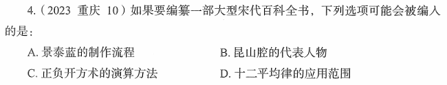

# 错题 72：历史/科技-中国古代科技成就

**来源**：

点击查看答案

<b>你的答案</b>：A 
<b>正确答案</b>：C  
<b>详细解答</b>： A项错误：景泰蓝，中国著名特种金属工艺之一，明代景泰年间这种工艺技术水平达到了巅峰，制作出的工艺品最为精美。"景泰蓝"这个称谓最早见于清宫造办处档案。故"景泰蓝的制作流程"不可能被编入有关宋代的百科全书。  
C项正确：正负开方术是中国古算法，指中国古代的一种求一元高次方程的数值解法。这一方法是秦九韶总结和改进了《九章算术》的"开方术"、刘益的"正负开方术"及贾宪的"增乘开方法"得到的。秦九韶是南宋著名数学家，故"正负开方术的演算方法"可能被编入有关宋代的百科全书。  
<b>错误原因</b>：不熟悉中国古代科技成就

