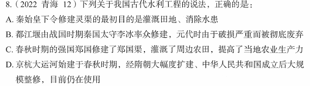

# 错题 73：历史/地理-中国古代工程成就

**来源**：

点击查看答案

<b>你的答案</b>：C 
<b>正确答案</b>：D  
<b>详细解答</b>： C项错误：郑国渠，于秦王政元年（公元前246年）由韩国水工郑国在秦国主持穿凿兴建，约十年后完工。郑国渠是古代劳动人民修建的一项伟大工程，属于最早在关中建设的大型水利工程，位于今天的陕西省泾阳县西北25千米的泾河北岸。  
D项正确：京杭大运河始建于春秋时期，是世界上里程最长、工程最大的古代运河，并且使用至今。春秋时期吴国为伐齐国而开凿邗沟，隋朝大幅度扩修并贯通至都城洛阳且连涿郡，元朝翻修时弃洛阳而取直至北京。中华人民共和国成立后对运河进行了大规模整修，使其重新发挥航运、灌溉、防洪和排涝的多种作用。京杭大运河开凿到现在已有2500多年的历史。  
<b>错误原因</b>：对我国古代工程成就不熟悉

