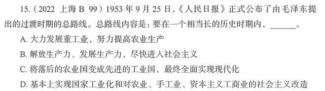

# 错题 74：政治/历史-过渡时期总路线

**来源**：

点击查看答案

<b>你的答案</b>：C 
<b>正确答案</b>：D  
<b>详细解答</b>： D项正确，A、B、C三项错误：1953年9月25日，《人民日报》正式公布了由毛泽东提出的过渡时期的总路线。总路线内容是：要在一个相当长的历史时期内，基本上实现国家工业化和对农业、手工业、资本主义工商业的社会主义改造。这是国民经济发展的基本要求，又是实现三大改造的物质基础；而实现对农业、手工业和资本主义工商业社会主义改造又是实现国家工业化的必要条件。两者互相依赖，相辅相成。  
<b>错误原因</b>：不熟悉相关历史时期，认为三大改造不符合"相当长的历史时期内"

