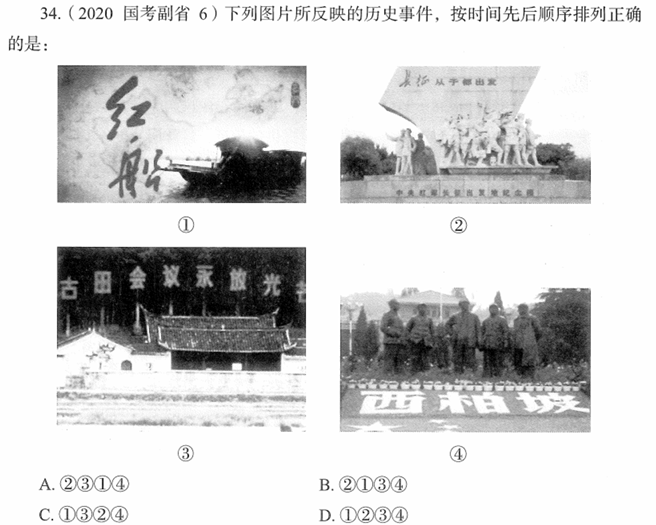

# 错题 77：历史/政治-古田会议

**来源**：

点击查看答案

<b>你的答案</b>：D 
<b>正确答案</b>：C  
<b>详细解答</b>： 图3反映的是1929年12月28日至29日召开的古田会议，即中国共产党红军第四军第九次代表大会。此次会议在福建省上杭县古田村召开，是人民军队建设史上的一个重要里程碑。这次会议的主要任务在于克服由于红四军的组织成分和长期处于艰苦的战斗环境而出现的各种非无产阶级思想，加强党对军队的领导。  
<b>错误原因</b>：不熟悉古田会议相关史实

