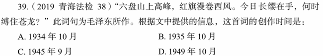

# 错题 79：文学/历史-毛泽东诗词与红军长征

**来源**：

点击查看答案

<b>你的答案</b>：C 
<b>正确答案</b>：B  
<b>详细解答</b>： 此为毛泽东的《清平乐·六盘山》。六盘山，古称陇山，地处宁夏南部黄土高原，是红军长征时翻越的最后一座大山，因此也被称为"胜利之山"。1935年8月，毛泽东粉碎了张国焘分裂党、分裂红军的机会主义路线。9月中旬，红军攻克天险腊子口，奇迹般地越过岷山草地，进入甘肃南部。10月7日，红军在宁夏六盘山的青石嘴，又击败了前来堵截的敌骑兵团。当天下午，一鼓作气，翻越了六盘山。此词即作者翻越六盘山时的咏怀之作。因此，其创作时间是1935年10月。  
<b>错误原因</b>：不熟悉红军长征相关史实

