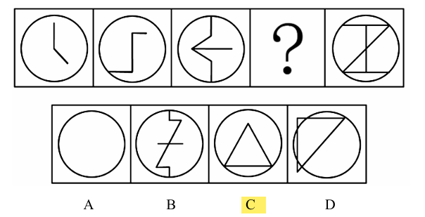

# 错题 8：图形推理-数量类-点（框上/框内交点运算）

**来源**：决战行测5000题（上册）- 数量规律-点 - 夯实基础第4题

点击查看答案

<b>你的答案</b>：— 
<b>正确答案</b>：C  
<b>详细解答</b>： 观察发现，题干图形均有圆形外框，且内部线条交叉明显，优先考虑数框上/框内交点。题干图形框上交点数依次为0、1、2、？、4，框内交点数依次为1、2、3、？、3，框上交点数和框内交点数作差的绝对值均为1，只有C项符合。  
<b>错误原因</b>：当找不到成规律的点时，可考虑不同的点做运算

